# SWAMP-FHAB Field Data Collection App User Manual

This manual provides a comprehensive guide to using the SWAMP-FHAB Field Data Collection Application for recording and managing planktonic and benthic field data.

---

## Table of Contents
1. [**Introduction**](#1-introduction)
   * [Key Features](#key-features)
2. [**Getting Started**](#2-getting-started)
   * [Required Permissions](#required-permissions)
   * [User Profile Setup](#user-profile-setup)
   * [User Preferences](#user-preferences)
3. [**Map Features**](#3-map-features)
   * [Map Layers & Toggles](#map-layers--toggles)
   * [Interactive Map](#interactive-map)
   * [Preview Maps](#preview-maps)
4. [**Daily Workflow**](#4-daily-workflow)
   * [Morning Prep](#morning-prep)
   * [In the Field](#in-the-field)
   * [End of Day](#end-of-day)
5. [**Working Offline**](#5-working-offline)
   * [Device Storage](#device-storage)
   * [GPS Performance](#gps-performance)
6. [**Data Collection Forms**](#6-data-collection-forms)
   * [Planktonic Field Data Sheet](#planktonic-field-data-sheet)
   * [Benthic Field Data Sheet](#benthic-field-data-sheet)
   * [Combined Field Data Sheet](#combined-field-data-sheet)
   * [Core Form Features](#core-form-features)
7. [**Managing Records**](#7-managing-records)
   * [History & Editing](#history--editing)
   * [Exporting Data](#exporting-data)
   * [Sharing Data between Devices](#sharing-data-between-devices)
8. [**Tool Box Utilities**](#8-tool-box-utilities)
   * [BloomReport Helper](#bloomreport-helper)
   * [Chain of Custody (CoC)](#chain-of-custody-coc)
9. [**Resources & Guides**](#9-resources--guides)
   * [Visual Guides](#visual-guides)
   * [SOPs](#sops)
10. [**Administration & Global Sync**](#10-administration--global-sync)
   * [Administrative Profile Elevation](#administrative-profile-elevation)
   * [System Management (Local)](#system-management-local)
     * [Admin Station Code Manager](#admin-station-code-manager)
     * [Admin Data Management](#admin-data-management)
   * [Global and Shared Data (GitHub)](#global-and-shared-data-github)
   * [Super Admin: Detailed Global Workflows](#super-admin-detailed-global-workflows)
11. [**Glossary of Terms**](#11-glossary-of-terms)
12. [**Data Quality & Best Practices**](#12-data-quality--best-practices)
13. [**Troubleshooting**](#13-troubleshooting)
14. [**Application Maintenance**](#14-application-maintenance)
    * [Update System](#update-system)
    * [Manual Version Check](#manual-version-check)
15. [**BloomReport Helper: Detailed Workaround Guide**](#15-bloomreport-helper-detailed-workaround-guide)
    * [Option A: Chrome Extension (Desktop)](#option-a-chrome-extension-desktop)
    * [Option B: Android Bookmarklet (Chrome)](#option-b-android-bookmarklet-chrome)
    * [Option C: iOS/macOS Shortcut (Safari)](#option-c-iosmacos-shortcut-safari)
16. [**App Information**](#16-app-information)

---

## 1. Introduction
The SWAMP-FHAB Field Data Application is a robust, cross-platform solution designed specifically for environmental field personnel. Its primary purpose is to standardize the collection of water body observations, physical measurements, and laboratory sample metadata related to Freshwater Harmful Algal Blooms (FHABs) across California.

### Key Features
* **True Offline Architecture**: The application uses a local SQLite database, meaning every feature works—including photo capture and GPS validation—without a cellular signal.
* **Dual-Protocol Support**: Fully supports both the SWAMP Planktonic and Benthic sampling protocols.
* **Authoritative Station Registry**: Connects directly to the State Water Board's GitHub registry to ensure consistent station codes.
* **Automated Reporting**: Includes specialized tools to streamline data submission to the official BloomReport portal.

---

## 2. Getting Started

### Required Permissions
Upon first launch, please grant the following:
* **Location (Precise)**: Essential for coordinates and station validation.
* **Camera**: Used to capture and embed field photos.
* **Storage/Media**: Necessary for saving exported data files.

### User Profile Setup
Your User Profile is the "signature" for all your data.

1. Tap the **App Configuration** (cog icon) in the top-right corner.
2. Select **User Profile**.
3. Fill out your Name, Agency, Program, and Email.
4. Enter the **Field Lead** name for CoC documents.
5. Tap **Save**.

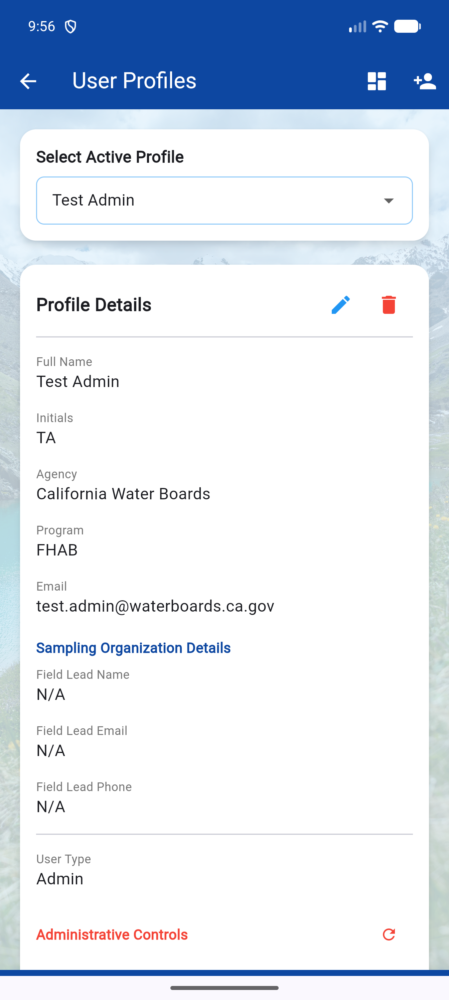

### User Preferences
User Preferences allow you to tailor the application's default behavior to your specific workflow. The settings are organized into five distinct categories:

1. Tap the **App Configuration** (cog icon).
2. Select **User Preferences**.
3. **General**: System-wide settings like Theme Mode (Light/Dark/System).
4. **Report View/Edit**: Set your default filters, sorting, and grouping for the record history screens.
5. **Station Manager**: Define your preferred starting filters and organizational structure for managing station codes.
6. **Preview Map Options**: Configure defaults for the small static maps shown in forms and history cards, including independent toggles for Water Bodies and Hydrologic Units.
7. **Interactive Map**: Define the default behavior for the full-screen map, including search radius and independent layer visibility defaults.

---

## 3. Map Features
The application includes powerful mapping tools to help you identify and validate sampling locations.

### Map Layers & Toggles
Both the **Interactive Map** and the **Location Preview Maps** (found on data forms) feature quick-toggle buttons for overlaying environmental data:

*   **Water Bodies (Waves Icon)**: Toggles the visibility of major California lakes and reservoirs.
*   **Hydrologic Units (Grid Icon)**: Toggles the boundaries and names of Hydrologic Units (HUs) and Sub-basins.

> [!TIP]
> Toggles used directly on a map are **session-based** and will reset to your global defaults when the map is reloaded. To change the permanent starting state of these layers, use the **User Preferences** screen.

### Interactive Map
Accessible from the Home Screen, this map allows you to:
*   Search for nearby stations within a defined radius.
*   View a heatmap of previous field visits.
*   Identify your current coordinates and nearest city/county.

### Preview Maps
Small maps embedded in the data collection forms provide immediate visual confirmation of your coordinates. These maps automatically "freeze" into a performance-optimized state after interaction to save battery and memory.

---

## 4. Daily Workflow

### Morning Prep
Before leaving for the field (while on Wi-Fi):
1. **Check Profile**: Ensure your active profile is correct.
2. **Sync Stations**: Open **Station Manager** (hash icon) and tap **SYNC FROM GITHUB**.

### In the Field
1. **Open Form**: Select the appropriate protocol from the Home Screen.
2. **GPS Lock**: Tap **USE CURRENT LOCATION** (the icon turns green when a lock is achieved).
3. **Station Code**: Select the station from the dropdown.
4. **Capture Observations**: Fill out the physical and biological fields.
5. **Photos**: Take at least one texture shot and one landscape shot.
6. **Save**: Tap **SUBMIT RECORD** or **SAVE DRAFT**.

### End of Day
1. **Review**: Go to the **History** tab of the form.
2. **Edit/Repair**: Correct any typos or missing information.
3. **Export**: Export your data as JSON or Unified ZIP for backup.

---

## 5. Working Offline

### Device Storage
The app stores all data locally in a persistent SQLite database. Data is safe even if the device restarts.

### GPS Performance
The app uses hardware GPS. In difficult terrain, wait 30-60 seconds for a precise lock (aim for &lt;10m accuracy).

---

## 6. Data Collection Forms

### Planktonic Field Data Sheet
Designed for open-water or surface-water observations.

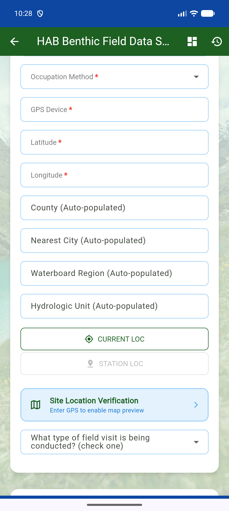
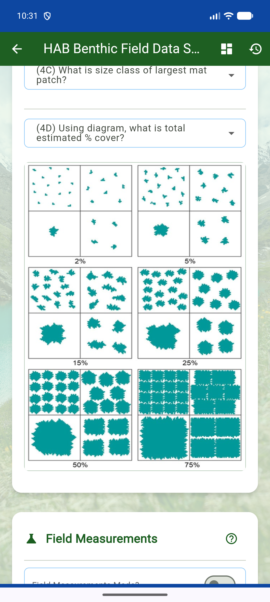

### Benthic Field Data Sheet
Focused on algal mats attached to the bottom or floating.

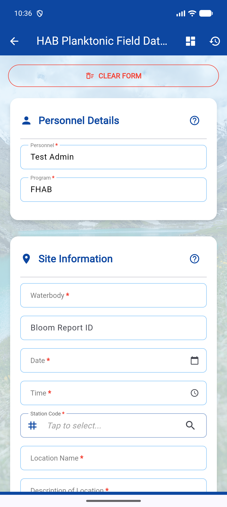
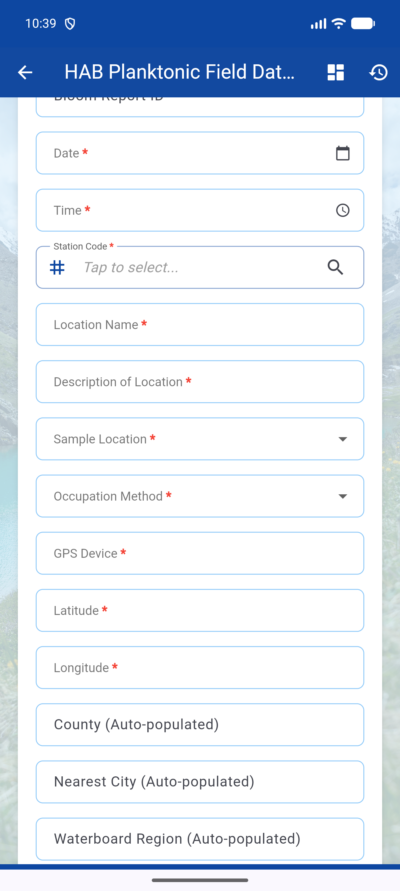
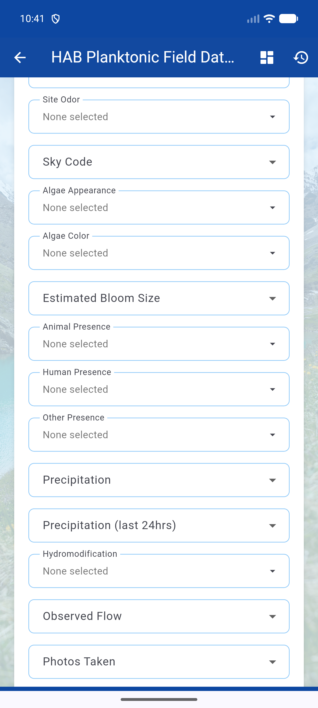

### Combined Field Data Sheet
Efficient option for comprehensive site assessments. Use the toggles to enable the required sections.

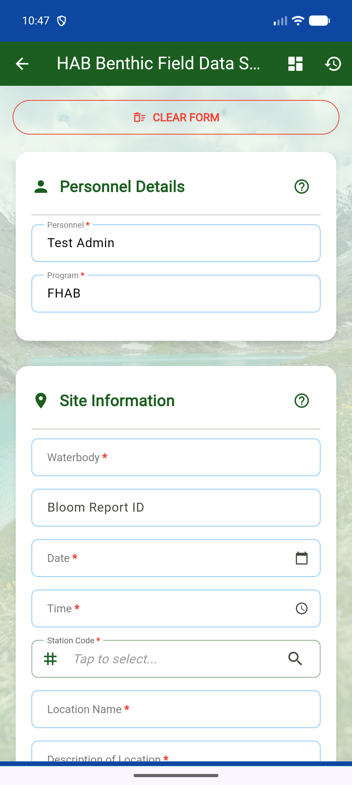

---

## 7. Managing Records

### History & Editing
The **History** screen (accessible via **View/Edit** on the Home Screen cards) is your primary dashboard for data management.

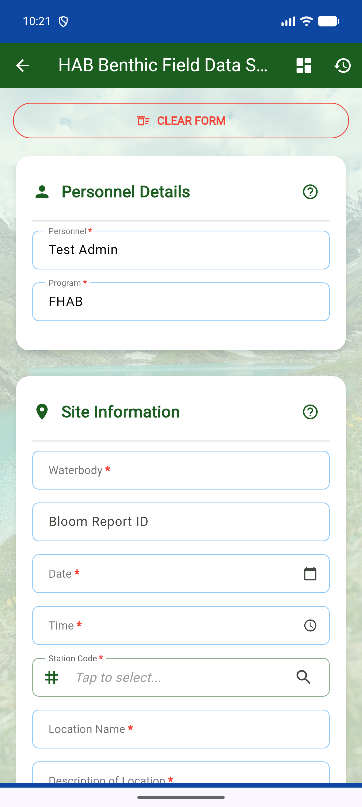

* **Status Icons**: Check icons indicate complete records, while caution icons may indicate missing critical data.
* **Preview Maps**: View the location where the record was captured.
* **Editing**: Tap **Edit** (pencil icon) on a card to modify existing records.

### Exporting Data
Export records as JSON or Unified ZIP (CSV + Photos) from the History screen or Admin Dashboard.

### Sharing Data between Devices
Move data between devices using the **Export JSON** and **Import JSON** features.

---

## 8. Tool Box Utilities

Access these via the **Help & Information** (question mark icon) -> **Tool Box**.

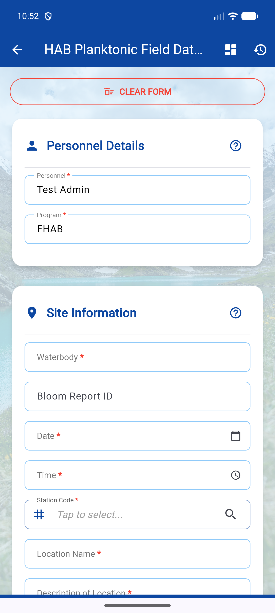

### BloomReport Helper
Streamline data submission to the official BloomReport portal by transfering your field visit data automatically.

#### Option A: Chrome Extension (Desktop Only)
The Chrome Extension provides the most seamless experience by automatically capturing the generated Bloom Report ID and linking it back to your field visit.
> [!IMPORTANT]
> The Chrome Extension is only supported on Desktop machines (Windows, macOS, Linux). It is **not** compatible with mobile browsers.

#### Option B: Mobile Workarounds (Android & iOS)
Because mobile browsers strictly block the clipboard API for security, standard automation is restricted. We provide specialized multi-step workflows for high-resolution photo transfer.
* [**Detailed Workaround Guide**](#15-bloomreport-helper-detailed-workaround-guide)

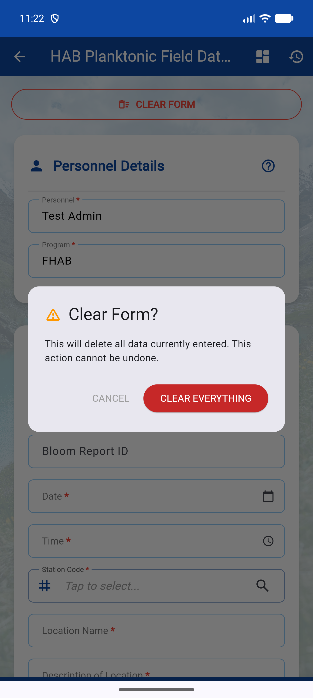

### Chain of Custody (CoC)
Standardize relinquishing field samples to a laboratory.

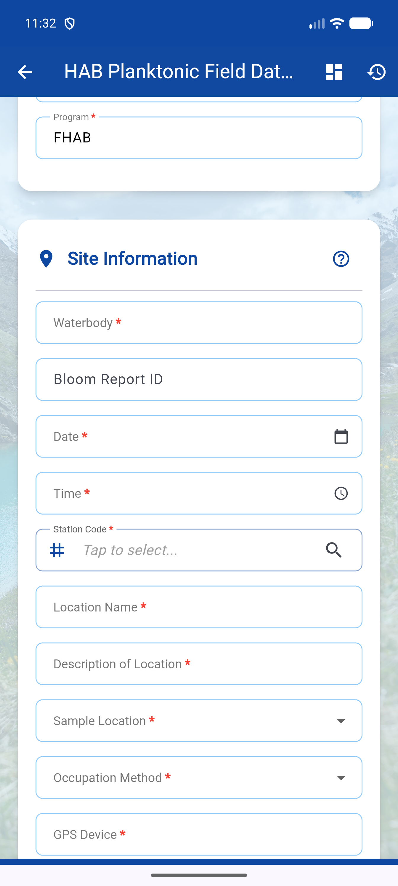

---

## 9. Resources & Guides

### Visual Guides
Embedded guides for cyanobacteria identification.

### SOPs
Access the full PDF text of the SWAMP Planktonic and Benthic SOPs.

---

## 10. Administration & Global Sync

Administrative features are protected by password or administrative profile elevation.

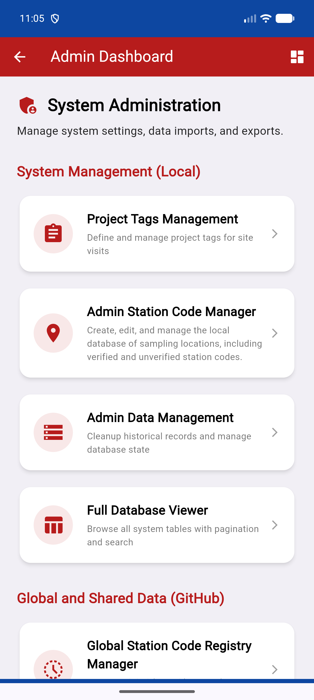

### Administrative Profile Elevation
To access administrative tools, you must elevate your user type in the **User Profile** screen.

*   **Admin**: Provides access to local system management tools. (Password: `FHAB`)
*   **Super Admin**: Provides access to global GitHub synchronization and registry management. (Password: `Cyanobacteria`)

### System Management (Local)
Tools for maintaining the local device database.

#### Admin Station Code Manager
Dedicated administrative view for managing the local station registry with advanced filtering.

#### Admin Data Management
Centralized hub for reviewing, merging, and cleaning field data across all protocols.

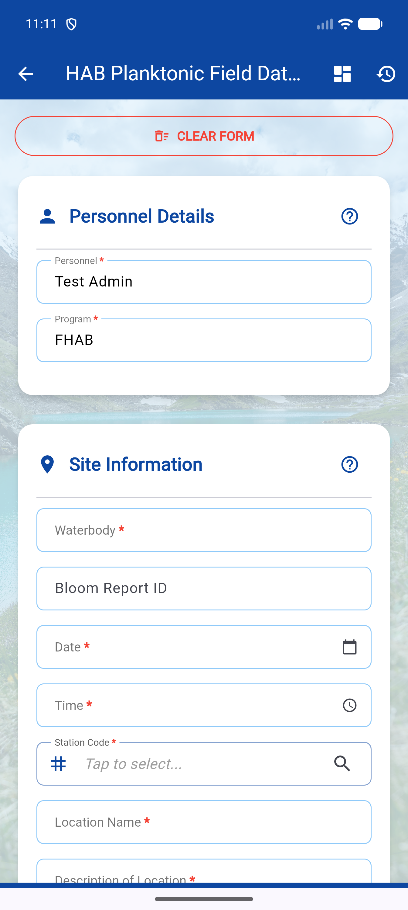

### Global and Shared Data (GitHub)
Super Admin tools for managing the authoritative state of the data registry.

### Super Admin: Detailed Global Workflows
The Super Admin role is responsible for the integrity of the shared data registry on GitHub.

#### 1. Configuration & Elevation
1. Open **User Profile**.
2. Change **User Type** to `Super Admin` and enter password `Cyanobacteria`.
3. Enter your **GitHub PAT** (Personal Access Token).
4. Enter the **Registry Repository** (e.g., `CA-WaterBoards/fhab-data-registry`).
5. Tap **TEST GITHUB CONNECTION**. A green checkmark confirms the app can reach the remote registry.

#### 2. Creating Shared Project Contexts
Before collecting data for a specific event or season, define a Project Tag:
1. Go to **Admin Dashboard** -> **Project Tags Management**.
2. Tap **(+) Add Tag**.
3. Enter a unique name (e.g., `SWAMP-2024-FALL`).
4. These tags will be available to all users after your next sync.

#### 3. Sharing and Syncing Data
Sharing is a two-way process handled through the Sync interface:
1. Go to **Admin Dashboard** -> **Shared Data Registry Sync**.
2. Review the "Pending" counts.
3. Tap **START SHARED DATA SYNC**.
   * **PUSH**: Your local unsynced records and tags are uploaded to GitHub.
   * **PULL**: Any new records submitted by other admins are downloaded to your device.

#### 4. Global Archiving (Global Delete)
To remove records from the shared registry entirely:
1. Go to **Admin Dashboard** -> **Shared Site Visit Archive Tool**.
2. Use filters or search to find the records.
3. Select the records and tap **ARCHIVE SELECTED**.
4. **IMPORTANT**: You must perform a **Registry Sync** (Step 3 above) to finalize this. The records will be moved to the `/deleted/` folder on GitHub and removed from all local admin databases.

#### 5. Managing the Global Station Registry
1. Go to **Admin Dashboard** -> **Global Station Code Registry Manager**.
2. Locate the station code.
3. Toggle the status to **Discontinued** if the station is no longer valid.
4. Sync to update the authoritative registry on GitHub.

---

## 11. Glossary of Terms
* **Registry**: Team JSON files on GitHub.
* **UUID**: Unique identifier for every visit record.
* **Verified**: Station code accepted by the Global Registry.

---

## 12. Data Quality & Best Practices
* Wait for green GPS indicator.
* Review records daily in the History tab.
* Always capture at least two photos per site.

---

## 13. Troubleshooting
* **GPS not locking**: Ensure location services are enabled and you have a clear view of the sky.
* **Sync errors**: Check your internet connection and GitHub PAT permissions.

---

## 14. Application Maintenance

### Update System
The app checks for updates on startup or can be checked manually.

### Manual Version Check
Manually check for updates in the **About** screen.

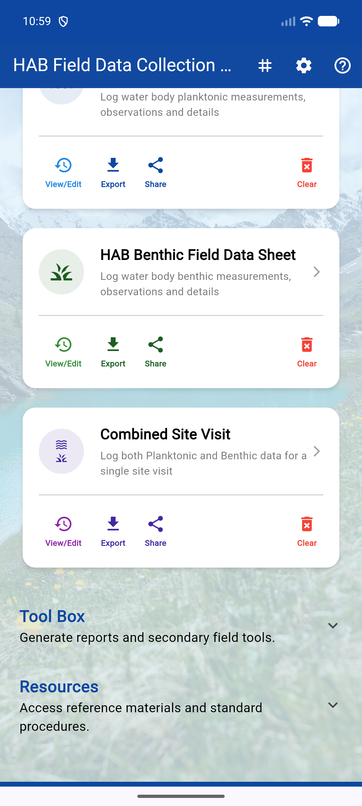

---

## 15. BloomReport Helper: Detailed Workaround Guide
The State Water Board portal uses complex nesting (iframes) and strict security that blocks standard automation. Follow these instructions precisely for your platform.

### Option A: Chrome Extension (Desktop)
1. **Load Extension**: Open Chrome, go to `chrome://extensions`, enable **Developer mode**, and tap **Load unpacked**. Select the `chrome_extension` folder from the app directory.
2. **Handoff**: In the FHAB App, tap **HANDOFF TO EXTENSION**.
3. **Autofill**: The portal will open and fill automatically.
4. **Link ID**: Upon successful submission, the extension will capture the ID and link it to your record in the app.

### Option B: Android Bookmarklet (Chrome)
Android has strict memory limits for bookmarks. To send high-resolution photos, you must use this three-part "Super Copy" process.

#### 1. Setup (One-time)
1. In the FHAB App, tap **STEP 1: COPY CODE** (Teal button).
2. Open Chrome and bookmark any page (Three Dots -> Star).
3. Tap **Edit** on the bookmark notification.
4. **Name**: `Autofill Bloom`.
5. **URL**: Delete the address, long-press, and **Paste** the code you copied.
6. Tap **Save**.

#### 2. How to Use
1. **Fill Text**: Open the State Portal. Tap the address bar, type `Autofill Bloom`, and select your bookmark. The text, date, and county will fill.
2. **Copy Photos**: Go back to the FHAB App and tap **STEP 2: COPY ALL PHOTOS** (Grey button).
3. **Inject Photos**: Return to the portal and select your `Autofill Bloom` bookmark again. It will detect the photos on your clipboard and upload them automatically.
4. **Capture ID**: After submitting, go to the "Success" page. Select your `Autofill Bloom` bookmark one last time. It will find the new ID and copy it to your clipboard.
5. **Link ID**: Return to the FHAB App, and in Step 4, tap the **Paste/Link** icon to save the ID.

---

### Option C: iOS/macOS Shortcut (Safari)
iOS Safari blocks scripts from reading the clipboard unless triggered by a native Shortcut.

#### 1. Setup (One-time)
1. **Enable Scripts**: Open iPhone **Settings** -> **Safari** -> **Advanced** -> Toggle **ON** "Allow Running Scripts".
2. **Copy Setup Script**: In the FHAB App, tap **STEP 1: COPY SETUP SCRIPT** (Indigo button).
3. **Create Shortcut**: Open the **Shortcuts** app, tap **+**, name it `Autofill Bloom`.
4. **Share Sheet**: Tap the **( i )** icon -> Toggle **ON** "Show in Share Sheet" -> Set to "Safari webpages".
5. **Add Actions**: Add **Get Clipboard**, then add **Run JavaScript on Webpage**.
6. **Paste Script**: Tap the JavaScript box, delete everything, and **Paste** the setup script from the app.
7. Tap **Done**.

#### 2. How to Use
1. **Copy Form Data**: In the FHAB App, tap **STEP 2: COPY FORM DATA** (Teal button).
2. **Fill Text**: Open the portal in Safari, tap the **Share** icon, and select **Autofill Bloom**. Form text, date, and county will fill.
3. **Copy Photos**: Go back to the FHAB App and tap **STEP 3: COPY ALL PHOTOS** (Grey button).
4. **Inject Photos**: Return to Safari and run the **Autofill Bloom** shortcut again. It will upload your high-res photos automatically.
5. **Capture ID**: On the success page, run the shortcut one last time to capture the new Bloom ID.
6. **Link ID**: Return to the app and link the ID in Step 4.

---

## 16. App Information
**Version**: 0.11.6
**Contact**: SWAMP FHAB Program
**Platform**: Web (PWA), Windows, Android, iOS
